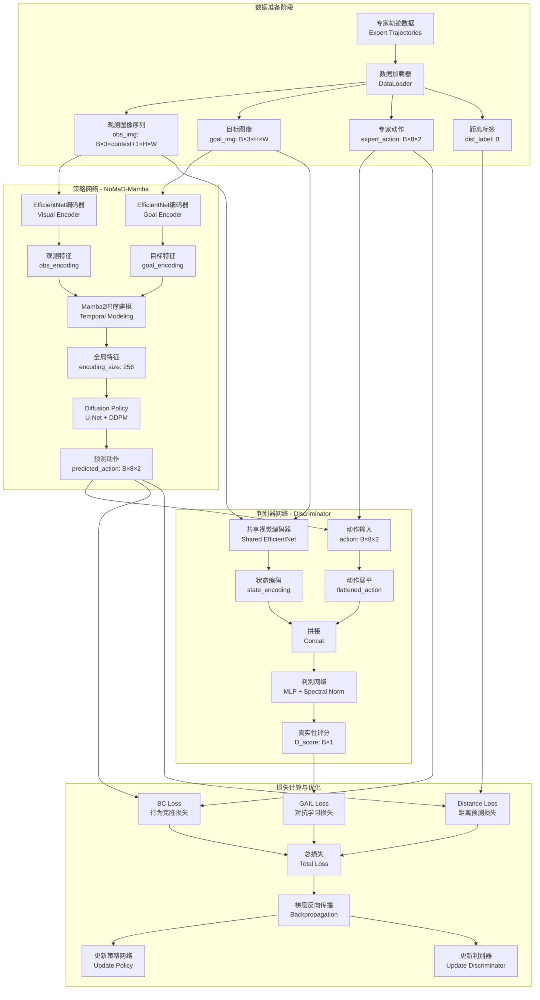
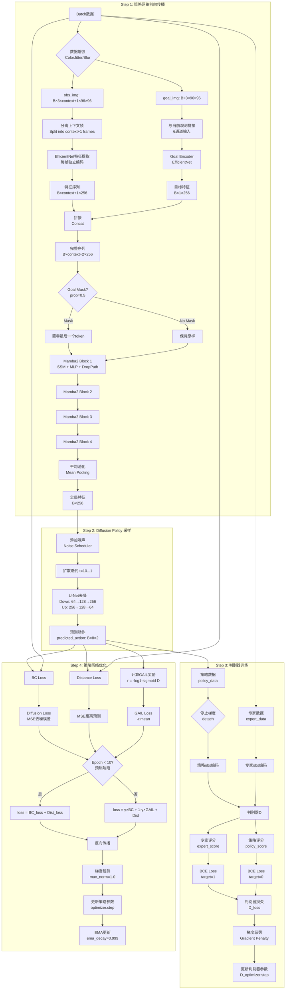
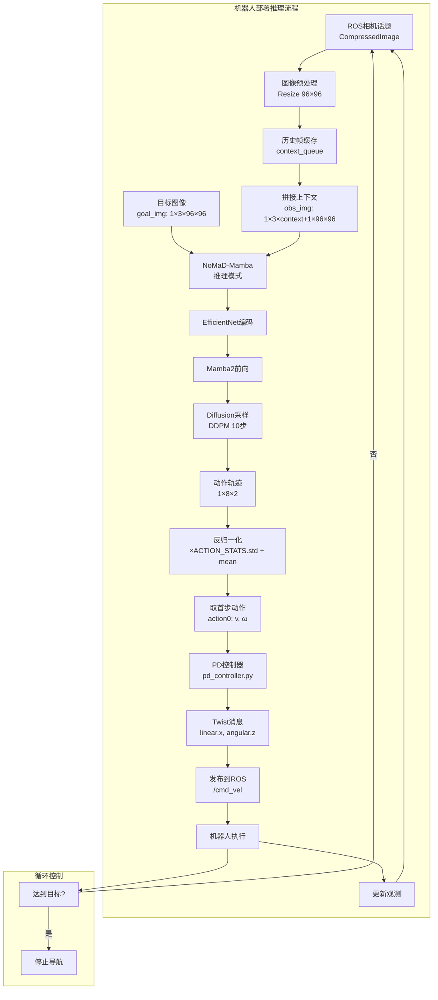
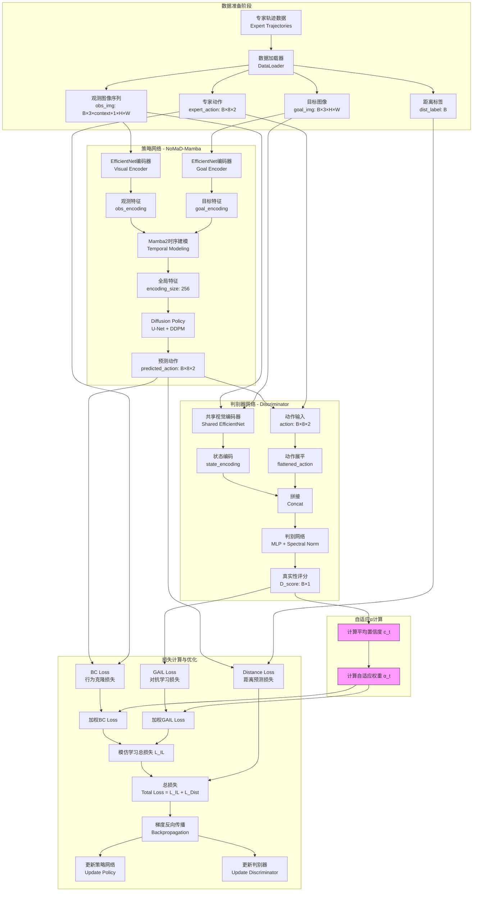
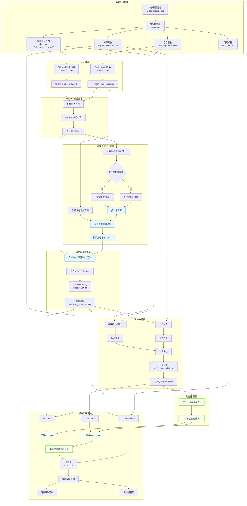

# NoMaD-Mamba + GAIL 融合数据流图

## 一、整体架构数据流



## 二、训练阶段详细数据流



## 三、推理阶段数据流



## 四、关键数据维度说明

### 输入数据
| 数据类型 | 维度 | 说明 |
|---------|------|------|
| obs_img | `[B, 3×(context+1), 96, 96]` | 观测图像序列,context=5 |
| goal_img | `[B, 3, 96, 96]` | 目标图像 |
| expert_action | `[B, 8, 2]` | 专家动作轨迹 (v, ω) |
| dist_label | `[B]` | 与目标的距离标签 |

### 中间特征
| 特征类型 | 维度 | 说明 |
|---------|------|------|
| obs_encoding | `[B, context+1, 256]` | 观测特征序列 |
| goal_encoding | `[B, 1, 256]` | 目标特征 |
| mamba_output | `[B, context+2, 256]` | Mamba2输出 |
| global_feature | `[B, 256]` | 全局池化特征 |

### 输出数据
| 输出类型 | 维度 | 说明 |
|---------|------|------|
| predicted_action | `[B, 8, 2]` | 预测动作轨迹 |
| dist_pred | `[B]` | 预测距离 |
| D_score | `[B, 1]` | 判别器评分 (0-1) |

### 损失项
| 损失类型 | 权重 | 公式 |
|---------|------|------|
| BC Loss | `γ = 0.6` | `MSE(pred_action, expert_action)` |
| GAIL Loss | `1-γ = 0.4` | `-log(1 - sigmoid(D(s,a)))` |
| Distance Loss | `α = 1e-4` | `MSE(pred_dist, dist_label)` |
| Gradient Penalty | `λ = 10.0` | `(‖∇D‖₂ - 1)²` |

## 五、训练超参数配置

```yaml
# 策略网络
batch_size: 1024
learning_rate: 1e-4
optimizer: AdamW
weight_decay: 0.05
max_grad_norm: 1.0
ema_decay: 0.999

# Mamba参数
mamba_num_blocks: 4
mamba_d_state: 64
mamba_dropout: 0.1
mamba_drop_path: 0.1

# Diffusion参数
num_diffusion_iters: 10
noise_scheduler: DDPM

# GAIL参数
use_gail: True
gail_gamma: 0.6  # BC权重
discriminator_lr: 1e-4
discriminator_hidden_dim: 256
discriminator_update_freq: 1
gail_warm_up_epochs: 10
gradient_penalty_weight: 10.0

# 数据增强
goal_mask_prob: 0.5
color_jitter: 0.3
p_blur: 0.1
p_gray: 0.1
```

## 六、关键流程节点说明

### 1. Goal Masking机制
- **概率**: 50%的样本会mask掉goal token
- **目的**: 增强模型鲁棒性,学习无目标导航
- **实现**: 将goal特征置零 + 调整平均池化权重

### 2. Mamba2时序建模
- **优势**: O(N)复杂度,处理长序列高效
- **残差连接**: FP32精度 + Fused Add Norm加速
- **DropPath**: 随机深度正则化,防止过拟合

### 3. Diffusion Policy采样
- **迭代次数**: 10步 (平衡速度与质量)
- **调度器**: DDPM线性噪声调度
- **条件**: 全局特征作为条件输入U-Net

### 4. 判别器对抗训练
- **更新频率**: 每1步策略更新执行1次判别器更新
- **梯度惩罚**: WGAN-GP稳定训练
- **Spectral Norm**: 限制判别器Lipschitz常数

### 5. BC正则化策略
- **预热阶段**: 前10 epoch纯BC训练
- **混合阶段**: γ=0.6 BC + 0.4 GAIL
- **目的**: 保持训练稳定性,防止GAIL发散

## 七、数据流关键时间点

| 阶段 | 输入 | 处理 | 输出 | 耗时 |
|-----|------|------|------|------|
| 视觉编码 | 图像 | EfficientNet | 特征 | ~15ms |
| 时序建模 | 特征序列 | Mamba2×4 | 全局特征 | ~8ms |
| 扩散采样 | 特征+噪声 | U-Net×10 | 动作 | ~50ms |
| 判别器 | 状态+动作 | MLP | 评分 | ~3ms |
| **总推理** | - | - | - | **~76ms (13Hz)** |

---

**注**: 
- 所有时间为单卡V100估计值
- Batch size影响吞吐,不影响单样本延迟
- 部署时可使用EMA模型提升性能




